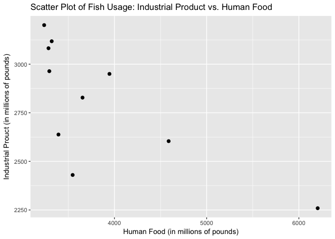
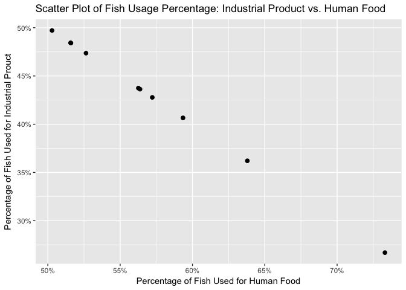

Week 1 Practice and Review: Problem 2.20
================
Alan Kessler

This problem is from Chapter 2: Charts and Graphs, Section 2.4: Charts and Graphs for Two Variables [(Black, 2016, p. 36)](#ref).

> 2.20. The U.S. National Oceanic and Atmospheric Administration, National Marine Fisheries Service, publishes data on the quantity and value of domestic fishing in the United States. The quantity (in millions of pounds) of fish caught and used for human food and for industrial products (oil, bait, animal food, etc.) over a decade follows. Is a relationship evident between the quantity used for human food and the quantity used for industrial products for a given year? Construct a scatter plot of the data. Examine the plot and discuss the strength of the relationship of the two variables.

The following packages are used in this problem:

``` r
library(dplyr)
library(knitr)
library(kableExtra)
library(ggplot2)
```

The Data
--------

The data originally from the problem is manually entered into vectors to create a data frame.

``` r
HumanFood <- c(3654,3547,3285,3238,3320,3294,3393,3946,4588,6204)
IndustrialProduct <- c(2828,2430,3082,3201,3118,2964,2638,2950,2604,2259)

# Create a data frame
FishUses <- data_frame(HumanFood, IndustrialProduct)

# Print the data frame as html
kable(FishUses, format="html") %>%
  kable_styling(bootstrap_options="striped", full_width=FALSE)
```

<table class="table table-striped" style="width: auto !important; margin-left: auto; margin-right: auto;">
<thead>
<tr>
<th style="text-align:right;">
HumanFood
</th>
<th style="text-align:right;">
IndustrialProduct
</th>
</tr>
</thead>
<tbody>
<tr>
<td style="text-align:right;">
3654
</td>
<td style="text-align:right;">
2828
</td>
</tr>
<tr>
<td style="text-align:right;">
3547
</td>
<td style="text-align:right;">
2430
</td>
</tr>
<tr>
<td style="text-align:right;">
3285
</td>
<td style="text-align:right;">
3082
</td>
</tr>
<tr>
<td style="text-align:right;">
3238
</td>
<td style="text-align:right;">
3201
</td>
</tr>
<tr>
<td style="text-align:right;">
3320
</td>
<td style="text-align:right;">
3118
</td>
</tr>
<tr>
<td style="text-align:right;">
3294
</td>
<td style="text-align:right;">
2964
</td>
</tr>
<tr>
<td style="text-align:right;">
3393
</td>
<td style="text-align:right;">
2638
</td>
</tr>
<tr>
<td style="text-align:right;">
3946
</td>
<td style="text-align:right;">
2950
</td>
</tr>
<tr>
<td style="text-align:right;">
4588
</td>
<td style="text-align:right;">
2604
</td>
</tr>
<tr>
<td style="text-align:right;">
6204
</td>
<td style="text-align:right;">
2259
</td>
</tr>
</tbody>
</table>
Scatter Plot
------------

I used `ggplot2` to plot the data.

``` r
ggplot(FishUses, aes(x=HumanFood, y=IndustrialProduct)) +
  geom_point(size=2) +
  ggtitle("Scatter Plot of Fish Usage: Industrial Product vs. Human Food") +
  xlab("Human Food (in millions of pounds)") +
  ylab("Industrial Prouct (in millions of pounds)")
```



The plot clearly shows a relationship between the two variables. As the amount of fish used for human food increases, the amount of fish used for industrial product decreases. The strength of the relationship appears strong, but I can test this to be sure.

Further Testing
---------------

I can compute the correlation coefficient between the two variables to measure the strength of the relationship. The relation appears nonlinear, so it makes sense to use Spearman's rank correlation.

``` r
cor(FishUses$HumanFood,FishUses$IndustrialProduct, method="spearman")
```

This gives a rounded result of -0.8182. Correlation coefficients range from -1 to 1, so this shows that there is a very strong negative relationship between the two variables.

It is important to test my assumption of nonlinearity from the original scatter plot as well. From the law of supply and demand, the amount of fish used for each application is likely related to the total amount of fish caught. This may suggest there is a linear relationship between the share of fish used for each application.

``` r
# Create data frame with added columns for share of fish
FishUsesShare <- FishUses %>%
  mutate(HumanFoodShare=HumanFood/(HumanFood+IndustrialProduct),
         IndustrialProductShare=IndustrialProduct/(HumanFood+IndustrialProduct))

# Plot this new relationship
ggplot(FishUsesShare, aes(x=HumanFoodShare, y=IndustrialProductShare)) +
  geom_point(size=2) +
  ggtitle("Scatter Plot of Fish Usage Percentage: Industrial Product vs. Human Food") +
  xlab("Percentage of Fish Used for Human Food") +
  ylab("Percentage of Fish Used for Industrial Prouct") +
  scale_x_continuous(labels=scales::percent) +
  scale_y_continuous(labels=scales::percent)
```



This shows an even stronger relationship. I can calculate the correlation to be sure.

``` r
cor(FishUsesShare$HumanFoodShare,FishUsesShare$IndustrialProductShare, method="pearson")
```

This gives a rounded result of -1, a complete inverse relationship between the two variables.

References
----------

Black, K. (2016). *Business statistics : for contemporary decision making*. Hoboken: Wiley.
