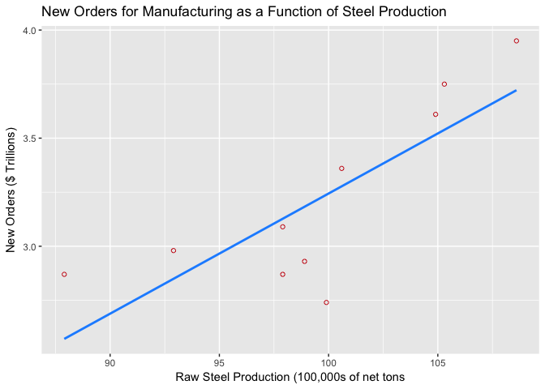

Week 8 Practice
================
Alan Kessler

The following packages are used this week:

``` r
library(knitr)
library(kableExtra)
library(ggplot2)
```

Problem 1
=========

This problem is from Chapter 11: Analysis of Variance and Design of Experiments, Section 11.2: The Completely Randomized Design (One-Way Anova) [(Black, 2016, p. 384)](#ref).

> 11.14 Family transportation costs are usually higher than most people believe because those costs include car payments, insurance, fuel costs, repairs, parking, and public transportation. Twenty randomly selected families in four major cities are asked to use their records to estimate a monthly figure for transportation cost. Use the data obtained and ANOVA to test whether there is a significant difference in monthly transportation costs for families living in these cities. Assume that α = .05. Discuss the business implications of your findings.

The Data
--------

The data originally from the problem is manually entered into vectors to create a data frame.

``` r
city <- c(rep("ATLANTA", 5), rep("NEW YORK", 5),
            rep("LOS ANGELES", 5), rep("CHICAGO", 5))
cost <- c(850, 680, 750, 800, 875, 450, 725, 500, 375, 700,
          1050, 900, 1150, 980, 800, 740, 650, 875, 750, 800)
df <- data.frame(city, cost)

# For display
pdf <- data.frame(df[1:5, 2], df[6:10, 2], df[11:15, 2], df[16:20, 2])
colnames(pdf) <- c("ATLANTA", "NEW YORK", "LOS ANGELES", "CHICAGO")

kable(pdf, format="html") %>%
  kable_styling(bootstrap_options="striped", full_width = FALSE)
```

<table class="table table-striped" style="width: auto !important; margin-left: auto; margin-right: auto;">
<thead>
<tr>
<th style="text-align:right;">
ATLANTA
</th>
<th style="text-align:right;">
NEW YORK
</th>
<th style="text-align:right;">
LOS ANGELES
</th>
<th style="text-align:right;">
CHICAGO
</th>
</tr>
</thead>
<tbody>
<tr>
<td style="text-align:right;">
850
</td>
<td style="text-align:right;">
450
</td>
<td style="text-align:right;">
1050
</td>
<td style="text-align:right;">
740
</td>
</tr>
<tr>
<td style="text-align:right;">
680
</td>
<td style="text-align:right;">
725
</td>
<td style="text-align:right;">
900
</td>
<td style="text-align:right;">
650
</td>
</tr>
<tr>
<td style="text-align:right;">
750
</td>
<td style="text-align:right;">
500
</td>
<td style="text-align:right;">
1150
</td>
<td style="text-align:right;">
875
</td>
</tr>
<tr>
<td style="text-align:right;">
800
</td>
<td style="text-align:right;">
375
</td>
<td style="text-align:right;">
980
</td>
<td style="text-align:right;">
750
</td>
</tr>
<tr>
<td style="text-align:right;">
875
</td>
<td style="text-align:right;">
700
</td>
<td style="text-align:right;">
800
</td>
<td style="text-align:right;">
800
</td>
</tr>
</tbody>
</table>

Test
----

``` r
summary(aov(cost ~ city, data = df))
```

    ##             Df Sum Sq Mean Sq F value   Pr(>F)    
    ## city         3 456630  152210   11.03 0.000358 ***
    ## Residuals   16 220770   13798                     
    ## ---
    ## Signif. codes:  0 '***' 0.001 '**' 0.01 '*' 0.05 '.' 0.1 ' ' 1

Based on the results of the test (p-value &lt; 0.05), I can reject the null hypothesis that the average transportation costs are equal. Business implications could include needed to compensate workers in cities that have higher transport costs, improving infrastrucutre in those cities, and advertising differently based on much transportation costs.

Problem 2
=========

This problem is from Chapter 12: Simple Regression Analysis and Correlation, Section 12.3: Determining the Equation of the Regression Line [(Black, 2016, p. 436)](#ref).

> 12.12 Can the annual new orders for manufacturing in the United States be predicted by the raw steel production in the United States? Shown below are the annual new orders for 10 years according to the U.S. Census Bureau and the raw steel production for the same 10 years as published by the American Iron & Steel Institute. Use these data to develop a regression model to predict annual new orders by raw steel production. Construct a scatter plot and draw the regression line through the points.

The Data
--------

The data originally from the problem is manually entered into vectors to create a data frame.

``` r
# Raw steel production (100,000s of net tons)
Steel <- c(99.9, 97.9, 98.9, 87.9, 92.9, 97.9, 100.6, 104.9, 105.3, 108.6)
# New Orders ($ Trillions)
Orders <- c(2.74, 2.87, 2.93, 2.87, 2.98, 3.09, 3.36, 3.61, 3.75, 3.95)
df <- data.frame(Steel, Orders)

kable(df, format="html") %>%
  kable_styling(bootstrap_options="striped", full_width = FALSE)
```

<table class="table table-striped" style="width: auto !important; margin-left: auto; margin-right: auto;">
<thead>
<tr>
<th style="text-align:right;">
Steel
</th>
<th style="text-align:right;">
Orders
</th>
</tr>
</thead>
<tbody>
<tr>
<td style="text-align:right;">
99.9
</td>
<td style="text-align:right;">
2.74
</td>
</tr>
<tr>
<td style="text-align:right;">
97.9
</td>
<td style="text-align:right;">
2.87
</td>
</tr>
<tr>
<td style="text-align:right;">
98.9
</td>
<td style="text-align:right;">
2.93
</td>
</tr>
<tr>
<td style="text-align:right;">
87.9
</td>
<td style="text-align:right;">
2.87
</td>
</tr>
<tr>
<td style="text-align:right;">
92.9
</td>
<td style="text-align:right;">
2.98
</td>
</tr>
<tr>
<td style="text-align:right;">
97.9
</td>
<td style="text-align:right;">
3.09
</td>
</tr>
<tr>
<td style="text-align:right;">
100.6
</td>
<td style="text-align:right;">
3.36
</td>
</tr>
<tr>
<td style="text-align:right;">
104.9
</td>
<td style="text-align:right;">
3.61
</td>
</tr>
<tr>
<td style="text-align:right;">
105.3
</td>
<td style="text-align:right;">
3.75
</td>
</tr>
<tr>
<td style="text-align:right;">
108.6
</td>
<td style="text-align:right;">
3.95
</td>
</tr>
</tbody>
</table>

Basic Model
-----------

``` r
summary(lm(Orders ~ Steel, data = df))
```

    ##
    ## Call:
    ## lm(formula = Orders ~ Steel, data = df)
    ##
    ## Residuals:
    ##      Min       1Q   Median       3Q      Max
    ## -0.49834 -0.19888  0.08829  0.19135  0.29850
    ##
    ## Coefficients:
    ##             Estimate Std. Error t value Pr(>|t|)   
    ## (Intercept) -2.31307    1.49895  -1.543  0.16138   
    ## Steel        0.05557    0.01504   3.694  0.00609 **
    ## ---
    ## Signif. codes:  0 '***' 0.001 '**' 0.01 '*' 0.05 '.' 0.1 ' ' 1
    ##
    ## Residual standard error: 0.2735 on 8 degrees of freedom
    ## Multiple R-squared:  0.6304, Adjusted R-squared:  0.5842
    ## F-statistic: 13.65 on 1 and 8 DF,  p-value: 0.006094

Raw steel production is a signficant variable in the model based on the above results.

Plot
----

``` r
ggplot(df, aes(x = Steel, y = Orders)) +
  geom_point(shape = 1, col = "firebrick3") +    
  geom_smooth(method = lm, se = FALSE, col = "dodgerblue") +
  ggtitle("New Orders for Manufacturing as a Function of Steel Production") +
  xlab("Raw Steel Production (100,000s of net tons") +
  ylab("New Orders ($ Trillions)")
```



References
==========

Black, K. (2016). *Business statistics : for contemporary decision making*. Hoboken: Wiley.
