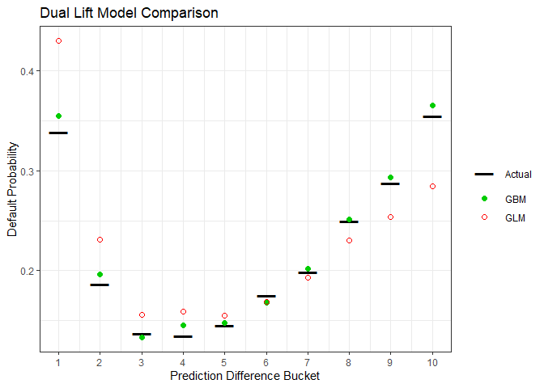

Meaningful Model Comparison
================
Alan Kessler

Jeremy Achin from DataRobot presented to a group of actuaries on
gradient boosting machines. In part of the presentation, he talked about
how comparing models is more than comparing fit statistics. To prove his
point he showed a chart that binned the differences in model predictions
and compared the results to the holdout observations.

To replicate that, I used the data from MSDS 498 where the selected
model is a logistic regression per the requirements of the project.
However, the best performing model uses XGBoost. They have reasonably
similar AUC values on testing data, so I thought it would be good to
compare them using this method as well.

## Setup

Libaries are loaded. In the case of logistic regression, there is
standalone scoring code that processes the data from the raw state to a
score. For the XGBoost challenger model, the processed data is loaded
and the model object is used for scoring.

``` r
library(dplyr)
library(ggplot2)
library(reshape2)

# Source the functions that apply feature engineering and score logistic
source("./src/score_logistic.R")

# Load the model object for the XGBoost model
gb_fit <- readRDS("./data/gb_fit.RDS")

# Load the original data which is used for scoring the logistic model
credit_card_default <- readRDS("./data/credit_card_default.RData")

# Load the processed validation data to score the XGBoost model
load("./data/validation_processed.Rdata")
```

## Score the Models

Both models are evaluated on the held out validation data. The scores
are combined with the target. The data is binned based on the difference
between the logistic regression and XGBoost scores. The average of each
score and the target are calculated by bin.

``` r
# Generate logistic regression predictions on the validation set
validation_data <- credit_card_default %>%
  filter(data.group == 3)
validation_glm_score <- score_glm(apply_features(conform(validation_data)))

# Generate XGBoost predictions on the validation set
validation_gb_score <- predict(gb_fit, newdata = validation_processed, "prob")

# Combine the predictions and target and calculate the average by difference bin 
comparison <- data.frame(DEFAULT = validation_processed[, 19],
                         GLM = validation_glm_score[, 2],
                         GBM = validation_gb_score[, 2]) %>%
  mutate(Difference = GBM - GLM,
         Bin = as.numeric(cut_number(Difference, 10, dig.lab = 10))) %>%
  group_by(Bin) %>%
  summarise(Actual = mean(DEFAULT),
            GBM = mean(GBM),
            GLM = mean(GLM))

# Reshape data for plotting
comparison_long <- melt(comparison, id.vars = 1)
```

## Plot the Dual Lift

The dual lift plot shows how the models compare to the actual results by
the magnitude of their difference. It demonstrates that the XGBoost
model performs better overall and that there is segmentation lost by
selecting the logistic regression.

``` r
ggplot(comparison_long, aes(Bin, value, group = variable)) +
  geom_point(aes(shape = variable, color = variable, size = variable)) +
  scale_shape_manual(values = c(95, 19, 1)) +
  scale_size_manual(values = c(10,2,2)) +
  scale_color_manual(values = c("black", "green3", "red")) + 
  scale_x_continuous(breaks = 1:10) +
  ylab("Default Probability") +
  xlab("Prediction Difference Bucket") +
  ggtitle("Dual Lift Model Comparison") +
  theme_bw() +
  theme(legend.title = element_blank())
```

<!-- -->
